<!DOCTYPE html>
<html>

<head>
    <meta charset="UTF-8">
    <meta name="viewport" content="width=device-width, initial-scale=1.0">
    <title>Document</title>
    <link rel="stylesheet" href="style.css">
    <link rel="stylesheet" media="screen and (max-width:800px)" href="tablet.css">

</head>

<body>

    <nav class="navbar">

        <ul>
            <li><a href="#home">Home</a></li>
            <li><a href="#about">About Us</a></li>
            <li><a href="#picture">Picture</a></li>
            <li><a href="#service">Service</a></li>
            <li><a href="#places">Places to Visit</a></li>

            <li><a href="#contact">Contact </a></li>

            <li> <a href="C:\Users\palla\OneDrive\Desktop\project\index2.html">Register</a></li>

        </ul>
    </nav>
    <section id="home">

        

            <h1 class="heading">WELCOME TO  RAJ MAHAL PALACE</h1>
            <button class="btn">
                Let's get started

            </button>
        

    </section>
    

        

        

        

            

        

    

    <audio id="mySong">
        <source src="palace.m4a" type="audio/mp3">
    </audio>
    

    <section id="about">
        <h1 class="heading">ABOUT US</h1>
        

            
            

                <h2>RAJ MAHAL PALACE</h2>
                
The Rajmahal Palace in Jaipur, Rajasthan is the former residence of the Maharaja of Jaipur located 5
                    miles (8.0 km)
                    outside the walls of the city of Jaipur on Bhawani Singh road.
                    The first building on the site was a garden house built in 1835 for the wet nurse of prince Ram
                    Singh II.
                    In 1887, during the reign of Maharaja Sawai Madho Singh, it was converted into a modest royal
                    hunting lodge, as the house
                    was located in the midst of a thick forest at that time.
                    In the early 20th century, it was expanded into a palace to the designs of Sir Samuel Swinton Jacob.
                    Maharajah Sawai Man Singh II made Rajmahal his principal residence and added a number of royal
                    suites in 1931.

                    It is now operated as a five-star hotel by the Taj Hotels Group. Anderson Cooper stayed at the
                    Rajmahal Palace in 2009.
                

            

        

    </section>
    <section id="picture">

        <h1 class="heading">GALLERY</h1>
        <marquee>
            
             
        </marquee>
        
         
        <marquee direction="up">
            
             
        </marquee>
        
         
        
         
        <marquee>
            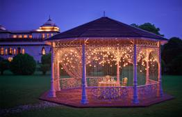
             
        </marquee>
        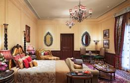
         
        <marquee direction="up">
            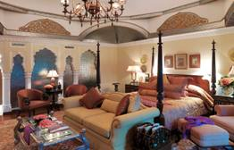
             
        </marquee>
        
         
        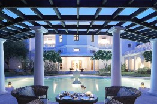
         
        <marquee>
            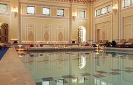
             
        </marquee>
        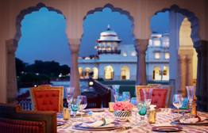
         
        <marquee>
            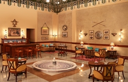
             
        </marquee>
        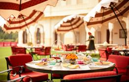
         
        <marquee direction="up">
            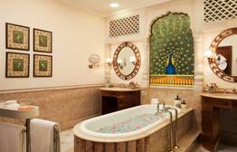
        </marquee>

    </section>
    <section id="service">
        <h1 class="heading">SERVICE</h1>

         

        

            

                 
                <h1 class="headings">Food</h1> 
                
In our palace we provide different types of food service. Here the guest can get table service, Self
                    service and specialised
                    or in situ service.We provide our guest both veg and non veg food along with drinks and many more
                    things. Here the guest will
                    gate breakfast, lunch ,snack along with red wine and dinner.
                

            

            

                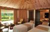 
                <h1 class="headings">Spa</h1> 
                
It is very common that guest would like to relax after a long flight. Hotel can offer classical
                    massage in the first.
                    And make sure you given an opportunity to guest to book more body treatment in the next day.

                

            

            

                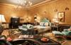 
                <h1 class="headings"> Rooms</h1> 
                
In our palace we provide different types of rooms ranging from Rs36000 to Rs410000 per day according
                    to rooms.
                    In the highest price room it is type of king room. In rooms we have ethentic type of decoration .
                    Here our guests can get the feeling
                    of Royal people.
                

            

            

                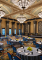 
                <h1 class="headings"> Meeting Room</h1> 
                
In our palace we provide our guests to do their personal/profossinal meentings. During meentings our
                    teams provide all essentials related
                    to meetings like snacks ,wines coffee, tea ,jucie and many more things.
                    In our meeting rooms we have all the arrangement related to meetings.
                

            

        

    </section>
    <section id="places">
        <h1 class="heading">PLACES TO VISIT</h1>
        

            
            

                <h2>TOURISM</h2>
                
India is a vibrant land of startling contrasts where both the traditional and modern worlds meet.
                    The world's seventh largest nation by area and the second largest in terms of population, India
                    boasts a rich heritage that's the result
                    of centuries of different cultures and religions leaving their mark. Things to do for travelers
                    include the opportunity to experience an array of sacred sites
                    and spiritual encounters, while nature lovers will enjoy its sun-washed beaches, lush national
                    parks,
                    and exciting wildlife sanctuaries.
                    From the magnificent Taj Mahal in Agra to the holy sites of Harmandir Sahib (formerly the Golden
                    Temple) in Amritsar and the
                    Mecca Masjid mosque in Hyderabad, visitors to this exotic country will discover a trove of
                    spiritual, cultural, and historical treasures.

                    To help you make the most of your time in this amazing country, refer often to our list of the top
                    things to do in India.
                    We are providing all the travel facilites.
                

                  
                 
                 
              <!---
<a href="file:///C:/Users/Dell/Desktop/places%20to%20visit/firstpage.html">  
                        CLICK HERE </a>
 -->
            

        

    </section>

    <section id="contact">
        <h1 class="heading">CONTACT</h1>
        <form action="insert.php" method="POST" class="form">
            <input type="text" name="name" class="input" placeholder="Enter Your Name">
            <input type="email" name="email" class="input" placeholder="Enter Your Email">
            <textarea name="msg" id="msg" cols="30" rows="10" placeholder="Enter Your Message"></textarea>

            <input type="submit" value="SEND" id="send">
        </form>

    </section>

</body>

</html>

##2nd
<!DOCTYPE html>
<html>
    <head>
        <title>Slide NAVBAR</title>
        <link rel="stylesheet" href="style2.css">
        <link href="https://fonts.googleapis.com/css2?family = Jost: wght@500&display=swap" rel="stylesheet">
        
    </head>
    <body>
        <nav class="navbar">

            <ul>
                <li><a href="C:\Users\palla\OneDrive\Desktop\project\index.html">Home</a></li>
                <li><a href="#about">About Us</a></li>
                <li><a href="#picture">Picture</a></li>
                <li><a href="#service">Service</a></li>
                <li><a href="#places">Places to Visit</a></li>
    
                <li><a href="#contact">Contact </a></li>
    
            </ul>
        </nav>
        

            <input type="checkbox" id="chk" aria-hidden="true">
            

                <form>
                    <label for="chk" aria-hidden="true">Sign Up</label>
                    <input type="text" name="txt" placeholder="User Name" required="">
                    <input type="email" name="email" placeholder="Enter Email" required="">
                    <input type="password" name="pswd" placeholder="Password" required="">
                <button>Sign Up</button>
                </form>
            

           

            <form>
                <label for="chk" aria-hidden="true">Login</label>
                    <input type="email" name="email" placeholder="Enter Email" required="">
                    <input type="password" name="pswd" placeholder="Password" required="">
           <button>Login</button>
                </form>
           
 
        

    </body>
</html>

##CSS
*{
    margin: 0;
    padding: 0;
    box-sizing: border-box;
}
html{
    scroll-behavior: smooth;
}
/*Navbar*/
.navbar{
    display: flex;
    justify-content: center;
    align-items: center;
    background-color:rgba(0, 0, 0, 0.5);
    position: sticky;
    top: 0;
}
.navbar ul{
    display: flex;
    list-style: none;
    margin: 20px 0px;
}
.navbar ul li{
    font-family: century;
    font-size: 1.1rem;
    font-weight: bold;
}
.navbar ul li a{
    text-decoration: none;
    color: white;
    padding: 8px 25px;
    transition: all .5s ease;
}
.navbar ul li a:hover{
    background-color: white;
    color: black;
    box-shadow: 0 0 10px white;
}
/* Home Section */
#home{
    display: flex;
    flex-direction: column;
    
    height: 840px;
    justify-content: center;
    align-items: center;
    color: white;
}
#home::before{
    content: "";
    position: absolute;
    top: 0;
    right: 0;
    right: 0;
    background: url('retreat-outdoor.png')no-repeat center center/cover;
    background-color: lightgrey;
    height: 900px;
    width: 100%;
    z-index: -1;
    opacity: .8;
}
.main{
    display: flex;
    flex-direction: column;
    /*border: 1px solid white;*/
    align-items: center;
    position: absolute;
    top: 30%;
    right: 10%;
}
.heading{
    font-family: century;
    color:rgb(165, 42, 42);
    font-size: 3rem;
    text-align: center;
    margin: 40px 0px;
}
.btn{
    padding: 10px 35px;
    background-color: transparent;
    border: 1px solid white;
    color: black;
    outline: none;
    transition: .6 ease;
}
.btn:hover{
    cursor: pointer;
    background-color: white;
    color: black;
    box-shadow: 0 0 5px white, 0 0 10px white, 0 0 15px white;
    font-weight: bold;
}
.content{
    width: 100%;
    
    position: absolute;
    top: 25%;
    
}
.left-col{
    margin-left: 12%;

}
.left-col h1{
    font-size: 90px;
    color: lavender;
    height: 110px;
    float: left;
}
.right-col{
    float: right;
    margin-right: 4%;
    margin-top: 120px;
    display: flex;
    align-items: center;
}
.right-col p{
    font-size: 19px;
    color: lightgoldenrodyellow;
    font-weight: 400;
    margin-right: 15px;
}
#icon{
    width: 50px;
    cursor: pointer;
}  
/*About*/
#about{
    display: flex;
    background-color: lemonchiffon;
    flex-direction: column;
    box-sizing: border-box;
    padding: 20px;
    margin-bottom: 50px;
}
#pic{
    display: flex;
}
#pic img{
    width: 500px;
    height: 300px;
}
#intro{
    display: flex;
    flex-direction: column;
    text-align: justify;
    padding: 10px;
}

#intro h2{
    font-size: 2rem;
    margin-bottom: 20px;
    color: blue;
}
#picture{
    display: flex;
    flex-direction: column;
    background: url('ranjan2.jpg')no-repeat center center/cover;
    color: black;
    align-items: center;
    padding: 20px;
}

.gallery{
    display: flex;
    flex-wrap: wrap;
    justify-content: space-around;
    box-sizing: border-box;
}
.gallery img{
    width: 20px;
    height: 20px;
    margin: 10px;
}
#services{
    display: flex;
    color: black;
    
    flex-direction: column;
    
    padding: 20px;
    align-items: center;
}
.row{
    display: flex;
    justify-content: space-around;
    box-sizing: border-box;
}
.box{
    display: flex;
    flex-direction: column;
    width: 250px;
    height: 350px;
    border: 1px solid black;
    margin: 10px;
    align-items: center;
    text-align: justify;
    padding: 10px;
    border-radius: 15px;
    background: linear-gradient(to top, rgb(255,45,45)50%, white 50%);
    background-size: 100% 200%;
    transition: all .8s;

}
.box:hover{
    background-position: left bottom;
    color: white;
    border: none;
    box-shadow: 0 0 20px rgb(255,45,45);
}
#places{
    display: flex;
    background-color: lightsalmon;
    flex-direction: column;
    box-sizing: border-box;
    padding: 20px;
    margin-bottom: 50px;
}
.h1{
    display: flex;
    text-align: center;
    flex-direction: column;
}
#img{
    display: flex;
    left: 60%;
    margin-top: 5px;
}

/* contct */
#contact{
    display: flex;
    flex-direction: column;
    box-sizing: border-box;
    background-color:black ;
    color: white;
    margin: 10px;
}
.form{
    display: flex;
    flex-direction: column;
    box-sizing: border-box;
    align-items: center;
    margin: 20px 0px;
}
.input{
    padding: 12px;
    margin: 15px;
    width: 30%;
    border: none;
    outline: none;
}
#msg{
    width: 20%;
    padding: 10px;
    margin: 15px;
    border: none;
    outline: none;
}
#send{
    padding: 10px;
    width: 10%;
    margin: 40px;
    border: none;
    outline: none;

}
#send:hover{
    cursor: pointer;
    box-shadow: 0 0 10px white;
}
#developers{
    display: flex;
    background: url('123.png')no-repeat center center/cover;
    color: darkred;
    
    flex-direction: column;
    
    padding: 20px;
    text-align: center;
    
   
}

.Row{
    display: flex;
    justify-content: space-around;
    box-sizing: border-box;
}
.Box{
    display: flex;
    flex-direction: column;
    width: 400px;
    height: 450px;
    border: 1px solid red;
    margin: 10px;
    align-items: center;
    text-align: justify;
    padding: 10px;
    border-radius: 15px;
    background: linear-gradient(to top,grey 50%, lightsalmon 50%);
    background-size: 100% 200%;
    transition: all .8s;

}
.Box:hover{
    background-position: left bottom;
    color: darkred;
    border: none;
    box-shadow: 0 0 20px lemonchiffon;
}        

##css2

body{
    margin: 0;
    padding: 0;
    justify-content: center;
    display: flex;
    align-items: center;
    min-height: 100vh;
    font-family: 'Jost',sans-serif;
    background: linear-gradient(to bottom,#0f0c29,#645cbf,#141425);
}
/*Navbar*/
.navbar{
    overflow: hidden;
    background-color:rgba(48, 46, 90, 0.603);
    position: fixed; /* Set the navbar to fixed position */
    top: 0; /* Position the navbar at the top of the page */
    width: 100%; /* Full width */
    display: flex;
    justify-content: center;
    align-items: center;
}
.navbar ul{
    display: flex;
    list-style: none;
    margin: 20px 0px;
}
.navbar ul li{
    font-family: century;
    font-size: 1.1rem;
    font-weight: bold;
}
.navbar ul li a{
    text-decoration: none;
    color: white;
    padding: 8px 25px;
    transition: all .5s ease;
}
.navbar ul li a:hover{
    background-color: white;
    color: black;
    box-shadow: 0 0 10px white;
}
.main{
    width: 350px;
    height: 500px;
    background: red;
    overflow: hidden;
    background: url("hotel\ 1.jpg") no-repeat center/cover;
    border-radius: 10px;
    box-shadow: 5px 20px 50px #000;
}
#chk{
    display: none;
}
.signup{
    position: relative;
    width: 100%;
    height: 100%;
}
label{
    color: #fff;
    font-size: 2.3em;
    justify-content: center;
    display: flex;
    margin: 60px;
    font-weight: bold;
    cursor: pointer;
    transition: .5s ease-in-out;
}
input{
    width: 60;
    height: 20px;
    background: #e0dede;
    justify-content: center;
    display: flex;
    margin: 20px auto;
    padding: 10px;
    border: none;
    outline: none;
    border-radius: 5px;
}
button{
    width: 50%;
    height:40px ;
    margin: 10px auto;
    justify-content: center;
    display: block;
    color: #fff;
    background: #777795;
    font-size: 1em;
    font-weight: bold;
    margin-top: 20px;
    border-radius: 5px;
    transition: .2s ease-in;
    cursor: pointer;
}
button:hover{
    background: #544275;
}
.login{
    height: 460px;
    background: #eee;
    border-radius: 60% / 10%;
    transform: translateY(-180px);
    transition: .8s ease-in-out;
}
.login label{
    color: #544275;
    transform: scale(.6);
}
#chk:checked ~ .login{
    transform: translateY(-500px);
}
#chk  :checked ~ .login label{
    transform: scale(1);
}
#chk :checked ~.signup label{
    transform: scale(.6);
}

## WEBSITE SCREENSHOTS

